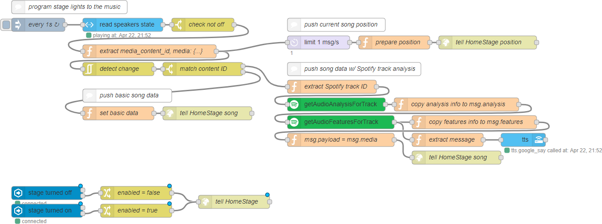

# HomeStage

Let's say you have a little home automation going on, like enjoying music and happen to own some stage lights, and you want to make it a 🔥 music room.

WELCOME TO HOMESTAGE.

This project is a work-in-progress and you're on your own right now.

# This fork

I forked the already very good working repository [sk89q/HomeStage](https://github.com/sk89q/HomeStage) and modified it for my use case. I removed everything I didn't need to make the code easier to understand for me.

I have LED strips in my home which are flashed with [espurna](https://github.com/xoseperez/espurna), whiuch means they can be controlled via MQTT. I did not use a microphone but rather the loopback of the raspberry the audio is playing on. I currently have removed the code for the API, but it looks good so I'll probably readd that later.

## Setup

You need Python 3.6+ on the raspberry, which is only shipped with Raspbian Buster (and higher). Make sure to update the raspberry.

1. Install dependencies using pipenv.
2. Run `./homestage-server.py`
3. *Setup the node-red flow* (not working yet in this fork)

### Setup pulseaudio on the raspberry

For the used library `soundcard` to work, you have to setup pulseaudio, which is not used by default on the raspberry. Here's a tutorial: https://raspberrypi.stackexchange.com/a/1544/74905

I'm also using [snapcast](https://github.com/xoseperez/espurna), for which I had to put pulseaudio in system mode. That's the tutorial I used: https://rudd-o.com/linux-and-free-software/how-to-make-pulseaudio-run-once-at-boot-for-all-your-users

### node-red flow

[Get the flow](readme/nodered_flow.json)
